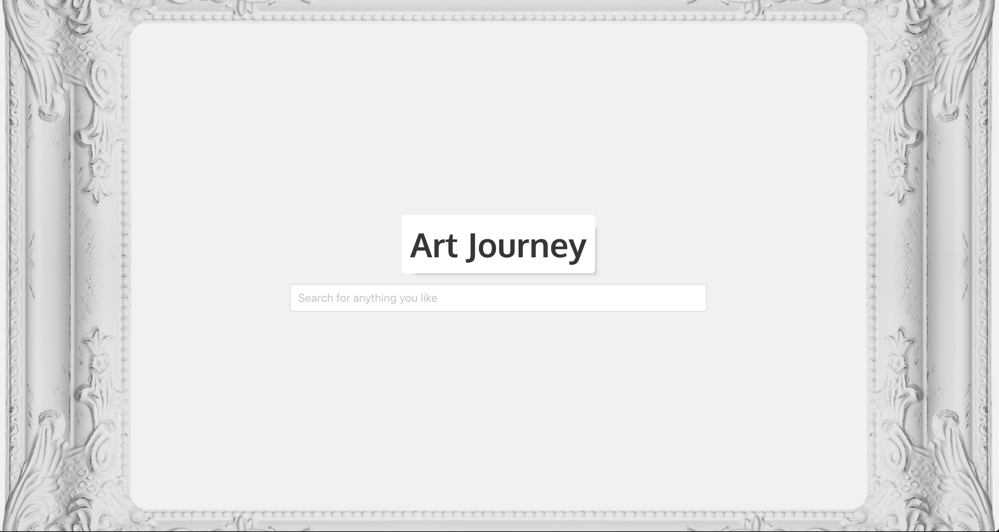

#  Project #2: Reacathon

## Overview

The second project is to **build a React application** that consumes a **public API**.

### Technical Requirements

Your app must:

* **Consume a public API** – this could be anything but it must make sense for your project.
* **Have several components** - At least one classical and one functional.
* **The app should include a router** - with several "pages".
* **Include wireframes** - that you designed before building the app.
* Have **semantically clean HTML** - you make sure you write HTML that makes structural sense rather than thinking about how it might look, which is the job of CSS.
* **Be deployed online** and accessible to the public.

**Timeframe**: 2 days of pair coding with [Dide Mertens](https://github.com/didemertens)

[Link to live website](https://artjourney-by-nl.herokuapp.com/)




## Technologies used:
- React
- Node.js
- Express
- Axios
- Bulma
- SCSS
- Git
- GitHub

## API used:
- Rijks Museum - https://data.rijksmuseum.nl/object-metadata/api/
- Mapbox - https://www.mapbox.com/

## Overview

### Planning
When we were given briefs for the project Dide and I spend few hours picking API. We wanted to pick something interesting and it was nice to come across Rijks Museum API.
While choosing the API we looked at the following conditions:
  - Clear documentation of usage
  - Easy acquisition of API key
  - Quality of data
Rijks Museum API checked all the boxes. And the quality of images they provide is amazing.

### Features
The website has a simple structure. Homepage has a search bar. When you type in and search for something it move a bit higher and search collection is shown below. We have limited the amount of results to 30 at the moment. If you click on one of the images it leads you to the image show page. Show page can be vertical or horizontal depending on the original image. There is a loading component that shows until the images are loaded. It was a bit tricky to implement, because we were using 'loaded' attribute of images, that we did not want to show until they are loaded. We have solved it by applying attribute 'invisible'. This way we had access to the ```img``` elements, but did not show them until they are loaded. We have implemented magnifying glass using external component.


### API data
Data provided by museum was quite interesting and we tried to use as much as possible. The interesting bits provided by API were a pallette, showing 7 most used colors in the painting and production place that gave the place name. The pallette implementation was straight forward, but to show production place on the map we first had to call mapbox geocoder to give us coordinates and then use those coordinates in the mapbox map.
The data provided by Rijks Museum was not always full, so we had to implement multiple checks for our features to work where data is available and not to break when it is not. There are a lot of ternary operators controlling the display if different elements


### Styling
We used bulma as much as possible, but also wrote some custom CSS. Using Sass simplified writing CSS. Styling is very light and simple, we found a nice painting frame image to put as background. Also we applied some custom fonts.

## Reflection

### Key Learnings
It was great experience building out React front end with quite a tight deadline. Pair programming is really helpful for focus.
React is a great library that has a specific work flow. As soon as it clicks it is much faster to progress. However sometimes small visual things require a lot of times to implement. Working with APIs is quite straight forward, but requires attention to spot different data types. I think it is trickier if you are using multiple APIs and combining them in your app.

### Wins
- Fully working project deployed online! It is nice to show people your work
- Great experience of of bug fixing due to inconsistent data provided
- Get to know how to work with API through the provided documentation
- Pair programming

### Challenges
- Pair programming. It was quite tough, but very interesting and beneficial. It was great to work on project discussing it live with another person, sharing ideas and finding solutions. But also challenging to negotiate different points of view and come to agreement. Dide was a great partner.
- Time constrain. I have a feeling that I would like to do more, but were not able to finish everything I wanted before the deadline.
- Mapbox API. It is tricky to implement it using state together with other data in the state. Also it was interesting to use their geocoder first and the use response in the actual map.
- Styling. It was challenging to make everything look as we wanted.

### Future features
- Add other museums
- Sorting by available markers and museums
- Choose the number of output, currently set to 30, but can be adjustable.
- Add my account where you can save the art pieces you like